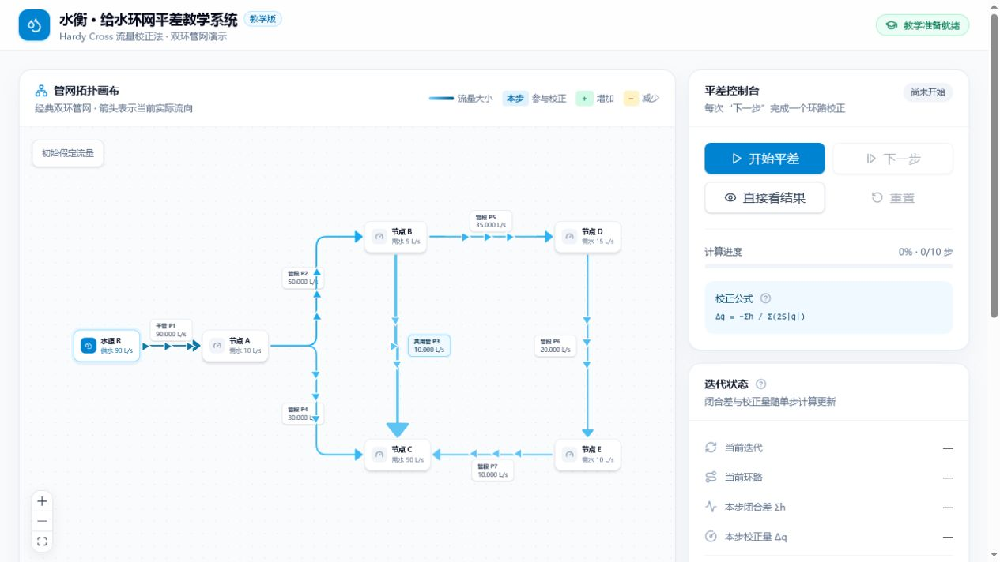
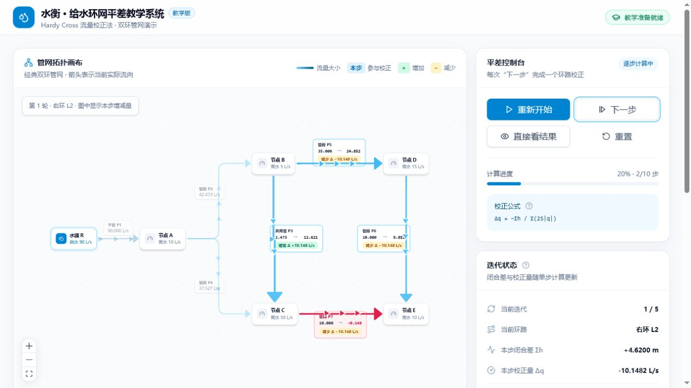

# Water Balance · Hardy Cross Network Visualizer

English | [简体中文](README.md)

An interactive Hardy Cross water-distribution network balancing visualizer for environmental engineering and water supply/drainage education. Instead of showing only the converged result, the application visualizes every loop correction, every pipe-flow change, and every flow-direction update.



## Features

- A classic double-loop teaching case with node demands, pipe lengths, diameters, Hazen-Williams coefficients, and resistance coefficients.
- A Hardy Cross flow-correction engine that preserves every iteration and loop calculation.
- Four teaching controls: Start, Next Step, Show Result, and Reset.
- Each active pipe displays its flow before correction, flow after correction, and step-specific `Δq`.
- Direction arrows are drawn directly along every pipe. Negative flow reverses the arrows and turns the pipe red.
- Pipes in the current loop are highlighted while unrelated pipes are de-emphasized.
- Detailed per-pipe values for `q`, `S`, `h = Sq|q|`, `2S|q|`, correction, and corrected flow.
- Complete iteration history, convergence feedback, and educational tooltips.
- Responsive desktop and mobile layouts.

## Step-by-step correction

The screenshot below shows the first correction of the right loop. P3 gains flow, while P5, P6, and P7 lose flow. P7 becomes negative after correction, so its pipe turns red and all direction arrows reverse immediately.



## Algorithm

The teaching case uses a quadratic resistance model:

```text
h = S · q · |q|
```

The Hardy Cross correction for each loop is:

```text
Δq = -Σh / Σ(2S|q|)
```

During each iteration, the left and right loops are corrected sequentially. Shared pipes are updated according to each loop's traversal direction. Balancing stops when the residual head-loss sum of every loop is within the configured tolerance.

> This project is intended for algorithm education and visualization. Real engineering design must also follow applicable standards, validated hydraulic models, boundary conditions, and professional verification workflows.

## Tech stack

- React 19 + TypeScript
- Vite
- Tailwind CSS 4
- React Flow (`@xyflow/react`)
- Radix UI Tooltip
- Vitest + ESLint

## Getting started

Node.js 20.19+ is required.

```bash
npm install
npm run dev
```

Open the local URL printed by Vite, usually `http://localhost:5173`.

## Commands

```bash
# Development server
npm run dev

# Algorithm tests
npm test

# Lint
npm run lint

# Production build
npm run build
```

## Project structure

```text
src/
├─ components/                 # Layout, controls, calculation tables, and UI
├─ features/
│  ├─ hardy-cross/             # Hardy Cross algorithm and tests
│  ├─ network/                 # Teaching case, nodes, and pipe visualization
│  └─ simulation/              # Step execution state and React Context
├─ App.tsx
└─ main.tsx
docs/screenshots/              # README screenshots
```

## Validation

The current version is verified with:

- Hardy Cross unit tests
- TypeScript strict type checking
- ESLint
- Vite production build
- Desktop and narrow-screen interaction checks

## License

[MIT](LICENSE)
